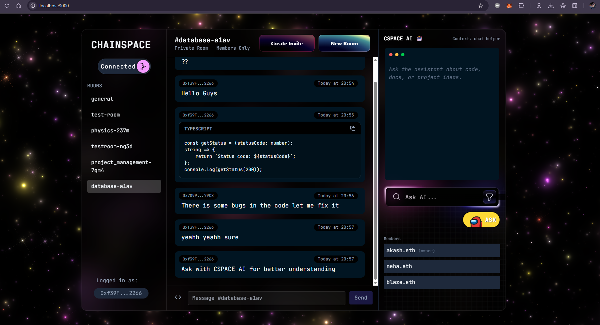
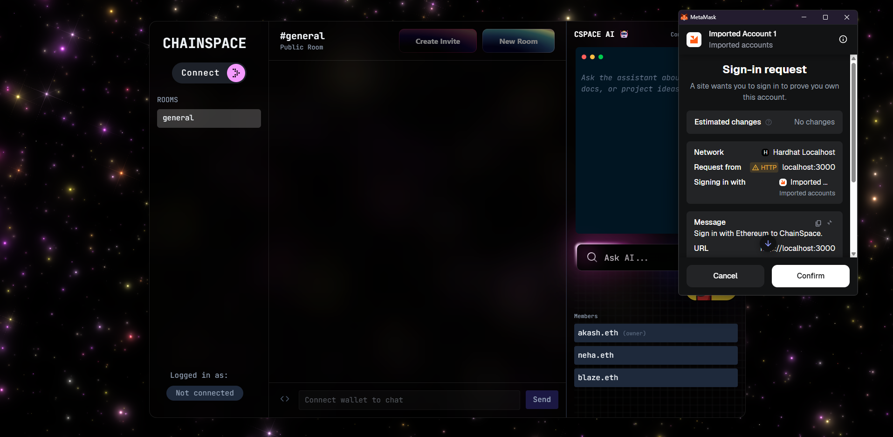
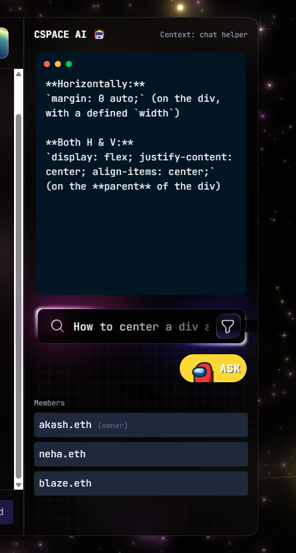

<div align="center">


# 🚀 ChainSpace
### Decentralized Encrypted Developer Chat Platform

**🔐 Blockchain-Powered | 📨 End-to-End Encrypted | 🧠 AI Integrated | ⚡ Real-time**

<p>
ChainSpace is a Web3 chat platform where users authenticate with Ethereum wallets, manage rooms via smart contracts, and communicate with AES-256 encryption. It features a built-in AI assistant powered by Gemini 2.0.
</p>

</div>

---

## 📌 Table of Contents

- [✨ Features](#-features)
- [🎥 Demo Screenshots](#-demo-screenshots)
- [🧠 Architecture Overview](#-architecture-overview)
- [⚙️ Tech Stack](#-tech-stack)
- [📦 Installation & Setup](#-installation--setup)
- [📘 Smart Contract Details](#-smart-contract-details)
- [🔐 End-to-End Encryption](#-end-to-end-encryption)
- [🧪 Testing the App](#-testing-the-app)
- [🛠 Future Improvements](#-future-improvements)
- [📄 License](#-license)

---

## ✨ Features

### 🧬 1. Wallet-based Authentication (SIWE)
- Secure login using **Sign-in With Ethereum (SIWE)**.
- No traditional username/password required.

### 🔐 2. On-Chain Room Ownership & Permissions
- Rooms are created directly on the **Smart Contract**.
- Only the room owner can add members.
- Access is verified using `isMember()` & `isOwner()` on the blockchain.

### 📝 3. Encrypted Messaging (AES-256-GCM)
Each room generates a dynamic key. Messages stored in Supabase are **ciphertext**, never plain text.
```javascript
const SECRET = `${roomId}-chainspace-secret`;
```
Messages stored in Supabase are ciphertext, not plain text.

### ⚡  4. Real-Time Messaging
- Supabase Realtime streams new messages instantly without page refreshes.

### 🧠 5. AI Assistant Panel
- Powered by Gemini 2.0 Flash API.
- Custom interactive input with code-friendly response UI.

### 🎨 6. Beautiful UI
- Galaxy animated background.
- Styled components + Tailwind CSS.
- Custom 3D buttons and neon input fields.

---

## 🎥 Demo Screenshots

### Encrypted Chat Room,Connect Wallet
"",""

### Invite Member
""

### AI Assistant
""

### 🔒 Access Denied: If a user attempts to access a room they are not a member of on-chain, access is blocked. 


---

## 🧠 Architecture Overview

```
┌──────────────────────────┐
│        Frontend          │
│ Next.js + Tailwind       │
│ Wallet connect + UI      │
└─────────────┬────────────┘
              │
              ▼
┌──────────────────────────┐
│     Smart Contract       │
│  RoomFactory.sol         │
│ - createRoom()           │
│ - addMember()            │
│ - isMember()             │
└─────────────┬────────────┘
              │
              ▼
┌──────────────────────────┐
│       Backend API        │
│ Next.js API Routes       │
│ Validates on-chain auth  │
└─────────────┬────────────┘
              │
              ▼
┌──────────────────────────┐
│        Supabase          │
│ Stores encrypted msgs    │
│ Real-time subscriptions  │
└──────────────────────────┘
```

---

## ⚙️ Tech Stack
Category | Technologies
Frontend | "Next.js 14 App Router, Tailwind CSS, Styled Components, Ethers.js (v6)"
Blockchain | "Solidity, Hardhat, Ethers.js Contract Calls, SIWE"
Backend | "Next.js API Routes, Supabase (PostgreSQL), AES-GCM Encryption"
AI Integration | Google Gemini 2.0 Flash API

---

## 📦 Installation & Setup


### 1️⃣ Clone the repository
```
git clone [https://github.com/YOUR_USERNAME/chainspace.git](https://github.com/YOUR_USERNAME/chainspace.git)
cd chainspace
```

### 2️⃣ Install dependencies
```
npm install
```

### 3️⃣ Start Hardhat local blockchain
```
npx hardhat node
```

### 4️⃣ Deploy the Smart Contract
- In a new terminal window:
```
npx hardhat run scripts/deploy.js --network localhost
```
### 5️⃣ Setup Supabase

- Create a new project and set up the following tables:

-- rooms

-- members

-- messages

### 6️⃣ Configure Environment Variables

- Create a .env.local file in the root directory:
```
NEXT_PUBLIC_SUPABASE_URL=your_supabase_url
NEXT_PUBLIC_SUPABASE_ANON_KEY=your_supabase_anon_key
GEMINI_API_KEY=your_gemini_api_key
NEXT_PUBLIC_CONTRACT_ADDRESS=your_contract_address
```

### 7️⃣ Run the Development Server

```
npm run dev
```

---

## 🔐 End-to-End Encryption

- Security is handled client-side before data reaches the database.
- Algorithm: AES-256-GCM
- Key Generation: Dynamic keys based on Room IDs.

---

## 🧪 Testing the App

- [ ] Test Room Creation: Create a room using Wallet A.
- [ ] Test Privacy: Switch to Wallet B; ensure Wallet B cannot see Wallet A's room content.
- [ ] Test Invites: Have Wallet A invite Wallet B. Verify Wallet B can now access the chat.
- [ ] Test Encryption: Open the Supabase dashboard and view the messages table. Ensure content looks like nonsense text (ciphertext).
- [ ] Test AI: Open the side panel and ask Gemini a coding question.

--- 

## 🛠 Future Improvements

- [ ] 🔑 Per-user encryption keys: Move away from room-based secrets to Diffie-Hellman key exchange.
- [ ] ♻️ Key Rotation: Implement mechanisms to rotate keys periodically.
- [ ] 🧩 Encrypted File Sharing: Allow users to upload IPFS hashes of encrypted files.
- [ ] 🔔 Push Notifications: Integrate web push notifications for new messages.
- [ ] 📱 Mobile UI: Responsive redesign for PWA support.
- [ ] 📦 Export Chat: Allow users to decrypt and download chat history.

---

## 📄 License

Distributed under the MIT License. See LICENSE for more information.
© 2025 ChainSpace


